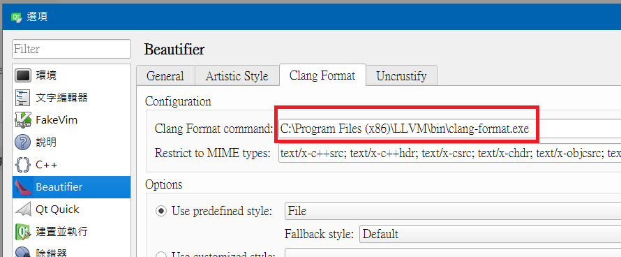

## Clang-Format Resource
- [A online tool for building your .clang-format interactively](https://clangformat.com/)
- [Clang-Format 官方手冊](https://clang.llvm.org/docs/ClangFormatStyleOptions.html)
- [LLVM Snapshot Builds](http://llvm.org/builds/)
- [clang-format_LLVM-10.0.0.exe.zip](clang-format_LLVM-10.0.0.exe.zip)

## 在 Windows Qt Creator 中使用 Clang-Format 的方法
1. 下載檔案: [`clang-format_LLVM-10.0.0.exe.zip`](clang-format_LLVM-10.0.0.exe.zip)
2. 把解壓縮後的 `clang-format_LLVM-10.0.0.exe` 存到 `你喜歡的路徑`
3. 點選 Qt Creator 選單上的 "說明(H)"
4. 點選選單上的 "關於外掛程式(P)"
5. 將清單中的 "Beautifier (experimental)" 的 Load 欄位勾選起來
6. 重開 Qt Creator
7. 點選 Qt Creator 選單上的 "工具(T)"
8. 點選選單上的 "選項(O)"
9. 在選單上選你在 (2) 所指定的 `你喜歡的路徑`，裡面的 `clang-format_LLVM-10.0.0.exe` 
    
10. 在選單上勾選 "Use predefined style"，然後選擇 "File"
11. 在你的專案根目錄放入 `.clang-format` 檔案
12. 設定執行快捷鍵，或是設定存檔時自動執行

## 在 Ubuntu Qt Creator 中使用 Clang-Format 的方法
1. `sudo apt install clang-format`
2. 點選 Qt Creator 選單上的 "說明(H)"
3. 點選選單上的 "關於外掛程式(P)"
4. 將清單中的 "Beautifier (experimental)" 的 Load 欄位勾選起來
5. 重開 Qt Creator
6. 點選 Qt Creator 選單上的 "工具(T)"
7. 點選選單上的 "選項(O)"
8. 點選左側選單的 "Beautifier"
9. 點選上方選單的 "Clang Format"
10. 在選單上勾選 "Use predefined style"，然後選擇 "File"
11. 在你的專案根目錄放入 `.clang-format` 檔案
12. 設定執行快捷鍵，或是設定存檔時自動執行
